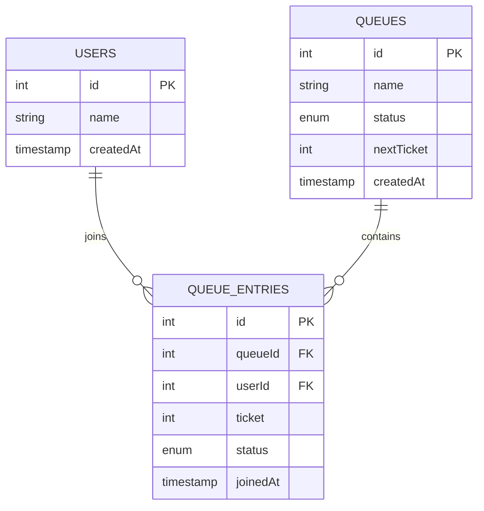

# Virtual Queue

Queue management system built with **Node.js**, **Express**, **TypeScript**, **PostgreSQL**, **React**, and **WebSockets**.

The application allows users to join a queue, monitor their position, and enables operators to manage the queue through a dedicated dashboard.

---

## Features

- Join a queue and receive a ticket
- Retrieve queue information
- View all queue entries
- View active queue entries
- Retrieve user queue information
- Operator dashboard overview
- Advance the queue
- Leave the queue
- Updates using WebSockets

---

## Tech Stack

### Backend

- Node.js
- TypeScript
- Express
- PostgreSQL
- Drizzle ORM
- Zod
- ws
- pnpm

### Frontend

- React
- TypeScript
- Vite
- Native WebSocket API

---

# Architecture

```
virtual-queue
│
├── backend
│   ├── controllers
│   ├── db
│   ├── routes
│   ├── services
│   ├── validators
│   ├── ws
│   ├── app.ts
│   └── index.ts
│
└── frontend
    ├── components
    ├── lib
    ├── schemas
    ├── services
    ├── types
    ├── views
    ├── App.tsx
    └── main.tsx
```

---

# Database Schema



---

# Queue Status

| Status | Description                   |
| ------ | ----------------------------- |
| open   | Queue accepts new users       |
| paused | Queue temporarily stopped     |
| closed | Queue no longer accepts users |

---

# Queue Entry Status

| Status  | Description         |
| ------- | ------------------- |
| waiting | Waiting in queue    |
| ready   | Current ticket      |
| served  | Already attended    |
| left    | User left the queue |

---

# REST API

## Queue

| Method | Endpoint               | Description           |
| ------ | ---------------------- | --------------------- |
| POST   | `/queue`               | Create a queue        |
| GET    | `/queue/:queueId`      | Get queue information |
| POST   | `/queue/:queueId/join` | Join a queue          |

---

## Queue Entries

| Method | Endpoint                                       | Description                |
| ------ | ---------------------------------------------- | -------------------------- |
| GET    | `/queue-entry/:queueId/entries`                | Get all entries            |
| GET    | `/queue-entry/:queueId/active-entries`         | Get active entries         |
| GET    | `/queue-entry/:queueId/entries/:entryId/info`  | Get user queue information |
| GET    | `/queue-entry/:queueId/overview`               | Operator dashboard         |
| PATCH  | `/queue-entry/:queueId/advance`                | Advance queue              |
| PATCH  | `/queue-entry/:queueId/entries/:entryId/leave` | Leave queue                |

---

# WebSocket

Clients connect to:

```
ws://localhost:3000/ws?queueId=<queueId>
```

Events emitted by the server:

| Event          |
| -------------- |
| entry:joined   |
| entry:left     |
| queue:advanced |

The frontend listens for these events and refreshes the queue data through the REST API.

---

# Environment Variables

## Backend

```
DATABASE_URL=
PORT=3000
```

## Frontend

```
VITE_WS_URL=ws://localhost:3000/ws
```

---

# Installation

## Backend

```bash
cd backend
pnpm install
```

Generate migrations

```bash
pnpm db:generate
```

Run migrations

```bash
pnpm db:migrate
```

Start the development server

```bash
pnpm dev
```

---

## Frontend

```bash
cd frontend
pnpm install
```

Run the development server

```bash
pnpm dev
```

---

# Scripts

## Backend

| Command            | Description              |
| ------------------ | ------------------------ |
| `pnpm dev`         | Development server       |
| `pnpm start`       | Production server        |
| `pnpm typecheck`   | TypeScript type checking |
| `pnpm db:generate` | Generate migrations      |
| `pnpm db:migrate`  | Apply migrations         |

---

## Frontend

| Command        | Description              |
| -------------- | ------------------------ |
| `pnpm dev`     | Development server       |
| `pnpm build`   | Build project            |
| `pnpm preview` | Preview production build |
| `pnpm lint`    | Run ESLint               |
